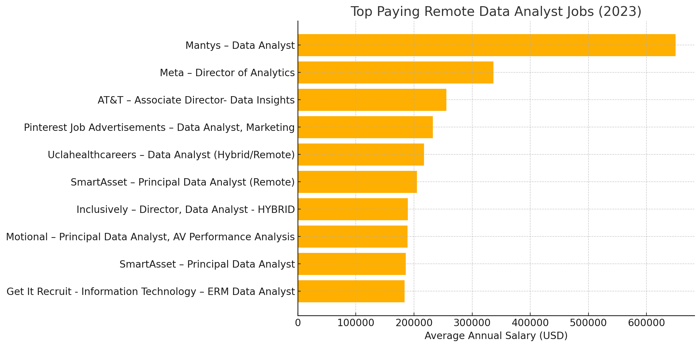
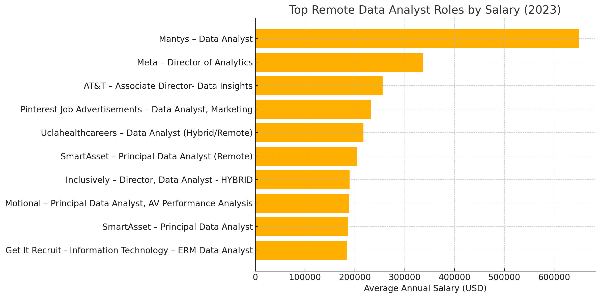

# Introduction
Welcome to my SQL Portfolio Project 📊, where we explore the dynamic job data space with a focus on highly sought-after data analyst roles. This is my journey toward uncovering top-paying jobs 💼, in-demand skills, and where high demand meets great opportunities in data analytics.

Check out my SQL queries here: [Project_sql folder](/Project_sql/)

# Background
The inspiration for this project came from the need for me to learn more about the job market for a data analyst. My goal was to find out what skills are most lucrative and demanded, and thus have my job search more focused and efficient.

The questions that I wished to respond to via my SQL queries were:

- What are the highest-paying jobs for data analysts

- What are the skills needed for these high-paying jobs?

- What are the most demanded skills for data analysts?

- What skills command higher pay rates?

- What are the best skills to acquire for a data analyst who wants to have the maximum job market value?
# Tools I used
In this project, various analysis techniques were employed using the following tools:

* **SQL** (Structured Query Language): Allowed me to communicate with the database, retrieve insights, and respond to my most important questions using queries.
* **PostgreSQL**: As the database management system, PostgreSQL enabled me to store, query, and manipulate the job posting information.
* **Visual Studio Code:** The free, open-source admin and development platform assisted me with managing the database and running SQL commands.

# The Analysis
Each of the query of this project was aimed to investigate specific aspects of the job market for data analyst.

Here's how I approached with each of the questions:

## 1. Top Paying Data Analyst Jobs
To identify the highest-paying roles, I filtered data analyst positions by average yearly salary and location, focusing on remote jobs. This query highlights the high paying opportunities in the field.
```sql
SELECT
    job_id,
    job_title,
    job_location,
    job_schedule_type,
    salary_year_avg,
    job_posted_date,
    name AS company_name
FROM
    job_postings_fact
LEFT JOIN company_dim ON
    job_postings_fact.company_id = company_dim.company_id
WHERE
    job_title_short = 'Data Analyst' AND
    job_location = 'Anywhere' AND
    salary_year_avg IS NOT NULL
ORDER BY
    salary_year_avg DESC
LIMIT 10;
```
Here's the breakdown of the top data analyst jobs:

- **Wide Salary Range:** Top 10 paying data analyst roles span from $184,000 to $650,000, indicating significant salary potential in the field.

- **Diverse Employers:** Companies like SmartAsset, Meta, and AT&T are among those offering high salaries, showing a broad interest across different industries.

- **Job Title Variety:** There's a high diversity in job titles, from Data Analyst to Director of Analytics, reflecting varied roles and specializations within data analytics.



*The Bar Graph shows the salary for the top 10 salaries for data analyst; GhatGPT generated this graph for me based on my SQL Query result.*

## 2. Skills for Top Paying Jobs
To understand what are skills required for the top-paying job roles, I joined the job postings table with the skills data, which provides insights into what the employers value for high-compensation roles.

```sql
WITH top_paying_jobs AS (
SELECT
    job_id,
    job_title,
    salary_year_avg,
    name AS company_name
FROM
    job_postings_fact
LEFT JOIN company_dim ON
    job_postings_fact.company_id = company_dim.company_id
WHERE
    job_title_short = 'Data Analyst' AND
    job_location = 'Anywhere' AND
    salary_year_avg IS NOT NULL
ORDER BY
    salary_year_avg DESC
LIMIT 10 
)

SELECT 
    top_paying_jobs.*,
    skills
FROM top_paying_jobs
INNER JOIN
    skills_job_dim ON top_paying_jobs.job_id = skills_job_dim.job_id
INNER JOIN
    skills_dim ON skills_job_dim.skill_id = skills_dim.skill_id
ORDER BY
    salary_year_avg DESC;
```
Here's the breakdown of the most demanded skills for the top 10 high paying data analyst jobs:
- **SQL** is leading with a count of 8.
- **Python** follows closely with a count of 7.
- Finally, **Tableau** is also highly sought after, with a count of 6. Other skills such as **R**, **Snowflake**, **Pandas**, and **Excel** show varying degress as per the demand.



*The Bar graph shows the count of skills for the top 10 paying jobs for data analyst; ChatGPT generated this graph for my SQL query.

## 3. In-Demand Skills for Data Analysts
This query helped me identify the skills that are frequently requested in job postings, thereby directing focus to areas with high demand.

```sql
SELECT
    skills,
    COUNT (skills_job_dim.job_id) AS demand_count
FROM
    job_postings_fact
INNER JOIN skills_job_dim ON
    job_postings_fact.job_id = skills_job_dim.job_id
INNER JOIN skills_dim ON
    skills_job_dim.skill_id = skills_dim.skill_id
WHERE
    job_title_short = 'Data Analyst'
GROUP BY
    skills
ORDER BY
    demand_count DESC
LIMIT 5;
```
Here's the breakdown of the most demanded skills for data analysts:

- **SQL (92,628 mentions)** The #1 skill most needed. **SQL** is used to query and manipulate data in databases — something required of all data analysts.

- **Excel (67,031 mentions)** Still applicable today! **Excel** is widely used for quick analysis, data cleansing, and reporting — primarily in commercial situations.

- **Python (57,326 mentions)** A strong programming language for analysis of data, automation, and even machine learning. The increasing need for analysts who can code is manifested through its high demand.

- **Tableau (46,554 mentions)** An industry-leading data visualisation solution. Tableau is prized for creating engaging dynamic dashboards and actionable business insights.

- **Power BI (39,468 mentions)** Another prominent data visualization instrument, widely used among Microsoft enterprise platforms. Ideal to produce dynamic reports.

|  Skills   |    Demand Count  |  
|-----------|------------------|
|SQL        |       92,628     |
|Excel      |       67,031     |
|Python     |       57,326     |
|Tableau    |       46,554     |
|Power BI   |       39,468     |

*Table of the demand for the top 5 skills in data analyst job postings*

## 4. Skills Based on Salary
Here I explored the average salaries associated with different skills which revealed skills that are paid the highest.

```sql
SELECT
    skills,
    ROUND(AVG(salary_year_avg), 0) AS avg_salary
FROM
    job_postings_fact
INNER JOIN skills_job_dim ON
    job_postings_fact.job_id = skills_job_dim.job_id
INNER JOIN skills_dim ON
    skills_job_dim.skill_id = skills_dim.skill_id
WHERE
    job_title_short = 'Data Analyst' AND
    salary_year_avg IS NOT NULL
GROUP BY
    skills
ORDER BY
    avg_salary DESC
LIMIT 25;
```
Here's a breakdown of the results for top paying skills for Data Analyst:

- **🧠 Specialized and rare skills lead to premium salaries:** Tools like SVN (a legacy version control system) and Solidity (used in blockchain smart contracts) offer very high average salaries because very few professionals still work with or master them. Companies maintaining older systems or innovating in niche areas often pay more to secure this scarce expertise.

- **🔧 Technical infrastructure and DevOps crossover boosts earnings:** Skills like Golang, Terraform, and VMware are not traditionally “data analyst” tools, but they’re increasingly relevant in roles that blur the line between analyst and data engineer. Analysts who can automate deployments or contribute to scalable backend systems are highly valued.

- **🤖 Machine learning and automation platforms are highly rewarded:** Tools such as DataRobot and MXNet are tied to automated machine learning or deep learning. These skills reflect a shift toward analysts being involved not just in reporting, but in model development and deployment — especially in enterprise environments.

- **📊 Traditional data tools still compete in salary:** dplyr, a tidyverse package in R, shows that core data manipulation skills are still well-paid. Though it doesn’t carry the “hype” of ML frameworks, it’s essential for effective data work in many organizations, especially those rooted in the R ecosystem.

|  Skills   |Average Salary ($)|  
|-----------|------------------|
|svn        |      400,000     |
|solidity   |      179,000     |
|couchbase  |      160,515     |
|datarobot  |      155,486     |
|golang     |      155,000     |
|mxnet      |      149,000     |
|dplyr      |      147,633     |
|vmware     |      147,500     |
|terraform  |      146,734     |
|twilio     |      138,500     |

*Table of the average salary for the top 10 paying skills for data analysts*

## 5. Most Optimal Skills to Learn
By combining the results from demand and salary data, this query aimed to pinpoint skills that are both in high demand and have high salaries, offering a strategic focus for skill development.

```sql
WITH skills_demand AS (
  SELECT
    skills_dim.skill_id,
		skills_dim.skills,
    COUNT(skills_job_dim.job_id) AS demand_count
  FROM
    job_postings_fact
	  INNER JOIN
	    skills_job_dim ON job_postings_fact.job_id = skills_job_dim.job_id
	  INNER JOIN
	    skills_dim ON skills_job_dim.skill_id = skills_dim.skill_id
  WHERE
    job_postings_fact.job_title_short = 'Data Analyst'
		AND job_postings_fact.salary_year_avg IS NOT NULL
    AND job_postings_fact.job_work_from_home = True
  GROUP BY
    skills_dim.skill_id
),
average_salary AS (
  SELECT
    skills_job_dim.skill_id,
    AVG(job_postings_fact.salary_year_avg) AS avg_salary
  FROM
    job_postings_fact
	  INNER JOIN
	    skills_job_dim ON job_postings_fact.job_id = skills_job_dim.job_id 
  WHERE
    job_postings_fact.job_title_short = 'Data Analyst'
		AND job_postings_fact.salary_year_avg IS NOT NULL
    AND job_postings_fact.job_work_from_home = True
  GROUP BY
    skills_job_dim.skill_id
)
SELECT
  skills_demand.skills,
  skills_demand.demand_count,
  ROUND(average_salary.avg_salary, 2) AS avg_salary 
FROM
  skills_demand
	INNER JOIN
	  average_salary ON skills_demand.skill_id = average_salary.skill_id
ORDER BY
  demand_count DESC, 
	avg_salary DESC
LIMIT 10 
; 
```
| Skill       | Demand Count | Average Salary ($)  |
|-------------|--------------|---------------------|
| SQL         | 398          | 97,237.16           |
| Excel       | 256          | 87,288.21           |
| Python      | 236          | 101,397.22          |
| Tableau     | 230          | 99,287.65           |
| R           | 148          | 100,498.77          |
| Power BI    | 110          | 97,431.30           |
| SAS         | 63           | 98,902.37           |
| PowerPoint  | 58           | 88,701.09           |
| Looker      | 49           | 103,795.30          |

Here's the breakdown of the most optimal skills for Data Analyst:

🔹 **SQL is the backbone of analytics:** With 398 job postings requiring it, SQL is by far the most in-demand skill. It’s essential for querying databases, extracting structured data, and forms the core of most data workflows. Despite being a standard requirement, its average salary remains competitive at around $97K, reflecting its ongoing importance.

🔹 **Excel and PowerPoint maintain their value:** Often considered basic, tools like Excel (256 postings) and PowerPoint (58 postings) are still heavily used for day-to-day analysis, dashboards, and stakeholder presentations. Their inclusion in job requirements shows that employers still prioritize communication and spreadsheet proficiency, particularly in business-oriented roles.

🔹 **Python and R drive higher salaries:** While Python (236 postings) and R (148 postings) appear less frequently than SQL or Excel, their average salaries exceed $100K. This suggests that data analysts who can code — for automation, data wrangling, or modeling — are positioned for higher-paying roles, especially in more technical or data science-adjacent positions.

🔹 **Visualization and BI tools are essential and rewarding:** Tools like Tableau (230 postings), Power BI (110 postings), and Looker (49 postings) show a clear trend: the ability to transform raw data into actionable insights through visual storytelling is crucial. Notably, Looker stands out with the highest average salary on the list ($103K+), indicating a premium for modern BI platforms that integrate well with cloud data environments.

🔹 **SAS still holds niche relevance:** Though not as widely required (63 postings), SAS continues to command nearly $99K in average salary, particularly in sectors like healthcare, banking, or government where it's still deeply embedded.
# What I Learned
Throughout this project, I honed several key SQL techniques and skills:

- **Complex Query Construction**: Learning to build advanced SQL queries that combine multiple tables and employ functions like **`WITH`** clauses for temporary tables.
- **Data Aggregation**: Utilizing **`GROUP BY`** and aggregate functions like **`COUNT()`** and **`AVG()`** to summarize data effectively.
- **Analytical Thinking**: Developing the ability to translate real-world questions into actionable SQL queries that got insightful answers.

# Conclusion
From the analysis, several general insights emerged:

1. **Top-Paying Data Analyst Jobs**: The highest-paying jobs for data analysts that allow remote work offer a wide range of salaries, the highest at $650,000!
2. **Skills for Top-Paying Jobs**: High-paying data analyst jobs require advanced proficiency in SQL, suggesting it’s a critical skill for earning a top salary.
3. **Most In-Demand Skills**: SQL is also the most demanded skill in the data analyst job market, thus making it essential for job seekers.
4. **Skills with Higher Salaries**: Specialized skills, such as SVN and Solidity, are associated with the highest average salaries, indicating a premium on niche expertise.
5. **Optimal Skills for Job Market Value**: SQL leads in demand and offers for a high average salary, positioning it as one of the most optimal skills for data analysts to learn to maximize their market

This project enhanced my SQL skills and provided valuable insights into the data analyst job market. The findings from the analysis serve as a guide to prioritizing skill development and job search efforts. Aspiring data analysts can better position themselves in a competitive job market by focusing on high-demand, high-salary skills. This exploration highlights the importance of continuous learning and adaptation to emerging trends in the field of data analytics.